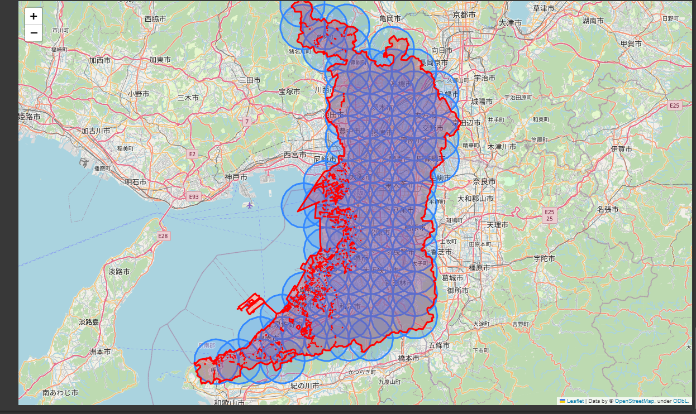

# Pythonデータ分析ハンズオンセミナー

    

- [Pythonデータ分析ハンズオンセミナー](https://bookplus.nikkei.com/atcl/catalog/23/07/28/00926/)（日経BP,　[小川英幸](https://twitter.com/OgawaHideyuki)）のサポートページです。

## 本書の概要

本書籍「[Pythonデータ分析ハンズオンセミナー](https://bookplus.nikkei.com/atcl/catalog/23/07/28/00926/)」は、[国勢調査のデータ](https://www.e-stat.go.jp/gis)(総務省 統計局統計調査部国勢統計課)の統計データと境界データを使って、データ取得・前処理・可視化・分析の工程が一通り体験し、どのようにビジネスにデータ分析を活用できるかとの内容となります。リアルなデータを使って工程を体験することにより、Pythonの文法をどのように使うかを生き生きと学べます。

一通りPythonの文法を学んだビジネスパーソンを対象に想定していますが、はじめてPythonを学ぶ方も取り組みやすいように２つの点を工夫しました。

1. Pythonの基礎的な文法もコンテンツに入れました
2. 環境作成に悩まずに済むよう、[Google Colaboratory](https://colab.research.google.com/)（以下 Colab）を利用しました

特に、Windows環境だと、位置情報を扱えるGeoPandasをインストールするのが難しいので、Colabを選択するのが初学者の方にとって良いと考えました。位置情報を扱うのは、モバイル端末などが普及した現代では欠かせないものだからです。以前は、ColabでGeoPandasを使う際には「pip install」しないといけなかったのですが、本書籍執筆中にその必要もなりました([それに関する筆者のQiita記事](https://qiita.com/OgawaHideyuki/items/aba25313dd30c0690120))。

本書の最初では、ビジネスにデータ分析を活かすポイントをとりあげました。短いパートですが、私が働いていてよく聞かれることへの回答を書いているので、データ分析がなぜ注目されるのか、ビジネスにどう使えばよいのか、考えられている方も、Chapter1を立ち読みしていただければ、少し靄が晴れると思います。

Chapter2は本書で明確にしたかった、オープンデータというビジネスに活用できるデータがあるという部分を扱った章です。オープンデータは非常にたくさんあります。ぜひ自分のビジネスに役立つものを探してみてください。

データ分析をビジネスに組み込む人が増えることを願っています。今後データの活用が活発になり、日本企業の生産性が上がることを願っています。

## 目次
Chapter1 データ分析をビジネスに活かす    
Chapter2 オープンデータのススメ    
Chapter3 Python入門     
Chapter4 分析に役立つライブラリ    
Chapter5 【ハンズオン】データの準備と前処理    
Chapter6 【ハンズオン】データの可視化    
Chapter7 【ハンズオン】戦略立案のためのデータ分析    
    

## コード

[notebookリポジトリ](https://github.com/mazarimono/python-data-seminar/tree/main/notebook)にすべてございます。

## 最後に作るデータを可視化したグラフ

## 間違い・誤表記のご連絡

間違い・誤表記に気付かれた方は、お手数ですが[issues](https://github.com/mazarimono/python-data-seminar/issues)にいただけますと幸いです。issuesのページに移動していただき、緑色の「New issue」を押していただくと、新しい書き込みが可能となります。

## FAQ

書籍の質問も[issues](https://github.com/mazarimono/python-data-seminar/issues)で受け付けています。

## ソースコードのライセンス

[MIT](https://github.com/mazarimono/python-data-seminar/blob/main/LICENSE)

