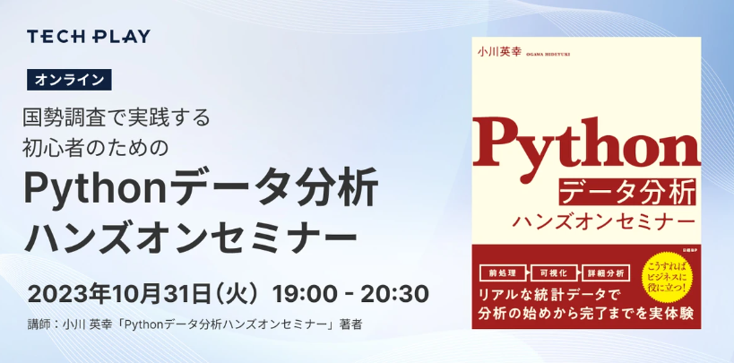

# [オンラインイベント] 国勢調査で実践する初心者のためのPythonデータ分析ハンズオンセミナー資料

- 日時: 2023/10/31 19:00 - 20:30
- イベントリンク: [https://techplay.jp/event/921607](https://techplay.jp/event/921607)
- [Slide link](https://speakerdeck.com/hideyuki_ogawa/guo-shi-diao-cha-deshi-jian-suruchu-xin-zhe-notamenopythondetafen-xi-hanzuonseminazi-liao)

## notebook

- [open with colab first sample.ipynb](https://colab.research.google.com/github/mazarimono/python-data-seminar/blob/main/hands-on-seminar/notebook/first_sample.ipynb)
- [open with colab prepro_position_data.ipynb](https://colab.research.google.com/github/mazarimono/python-data-seminar/blob/main/hands-on-seminar/notebook/prepro_position_data.ipynb)
- [open with colab interactive_data_visualization.ipynb](https://colab.research.google.com/github/mazarimono/python-data-seminar/blob/main/hands-on-seminar/notebook/interactive_data_visualization.ipynb)

